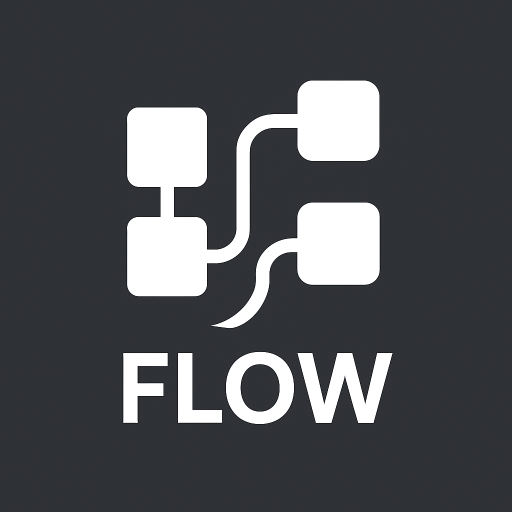

<p align="center">
  
</p>

<h1 align="center">🌊 Flow Language Support for VS Code</h1>

<p align="center">
  <a href="https://marketplace.visualstudio.com/items?itemName=SrijanSundaram.flow-lang">
    
  </a>
  <a href="https://github.com/srijansundaram/Flow-Language-VSCode/blob/main/LICENSE">
    
  </a>
  <a href="https://github.com/srijansundaram/Flow-Language-VSCode">
    
  </a>
</p>

---

## ✨ Overview

**Flow Language Support** brings full syntax highlighting, intelligent formatting, and custom file icons for `.flow` files used in the **Flow Compiler Project** — a modern data pipeline compiler designed for simplicity, speed, and readability.

This VS Code extension makes `.flow` files look and behave like a first-class language.

---

## 🚀 Features

| Feature                     | Description                                                            |
| --------------------------- | ---------------------------------------------------------------------- |
| 🧠 **Syntax Highlighting**  | Supports keywords, pipeline operators (`      >`), and DSL-like syntax |
| 💬 **Inline Comments**      | Uses `#` for line comments                                             |
| 🧩 **Custom File Icons**    | Adds premium Flow icon to `.flow` files                                |
| 🔄 **Auto-closing Pairs**   | Braces, brackets, quotes close automatically                           |
| 🧱 **Region Folding**       | Supports `#region` / `#endregion` folding                              |
| ⚡ **Seamless Integration** | Works directly with your Flow Compiler CLI                             |

---

## 🧰 Installation

### From Marketplace

1. Open VS Code → Extensions (`Ctrl+Shift+X`)
2. Search for **“Flow Language Support”**
3. Click **Install**

---

### Manual Installation (Optional)

If you want to install directly from this repository:

```bash
git clone https://github.com/srijansundaram/FLOW-LANG.git
cd FLOW-LANG
npm install -g @vscode/vsce
vsce package
code --install-extension flow-lang-1.0.0.vsix


🧪 Usage

1. Open a .flow file in VS Code
2. Enjoy syntax highlighting, icons, and editor features
3. (Optional) Manually enable icon theme:
   Press Ctrl+Shift+P → File Icon Theme: Flow File Icons

🗂 Folder Structure

flow-lang/
├── package.json
├── README.md
├── language-configuration.json
├── syntaxes/
│ └── flow.tmLanguage.json
├── icons/
│ ├── flow-icon.png
│ ├── flow-icon.svg
│ └── flow-icon-theme.json
└── LICENSE

🧑‍💻 Development

To test locally:
npm install -g vsce
vsce package
code --install-extension flow-lang-1.0.0.vsix

Or launch from VS Code:
Open folder → Press F5
A new Extension Development Host window opens
Open a .flow file to test syntax and icon

```

```

```
